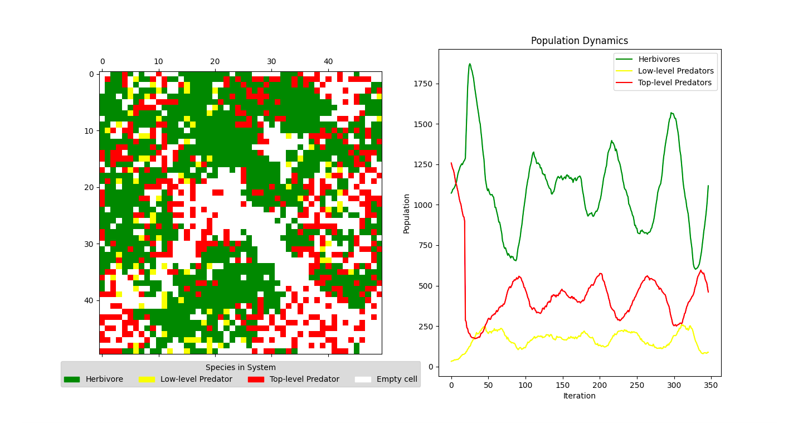
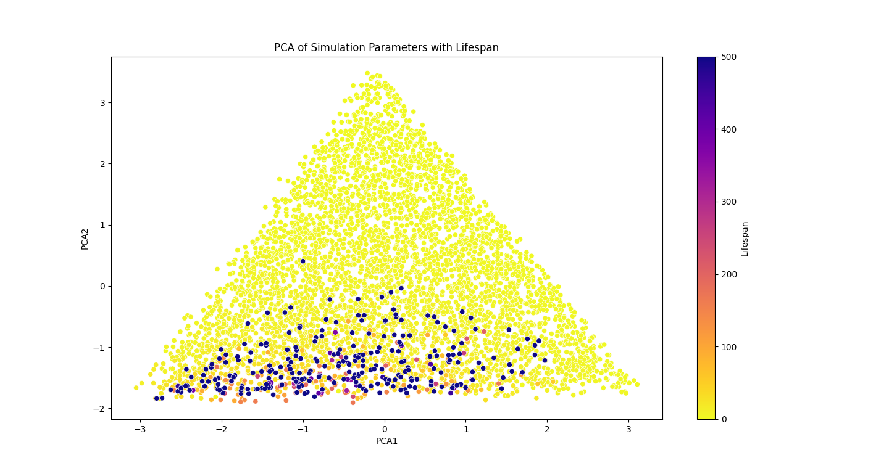

# Population Dynamics Systems

## A Study of Predator-Prey Interactions

### Introduction
This project explores the complex dynamics within a 2D cellular automaton predator-prey system, featuring three distinct types of actors: herbivores, low-level predators, and top-level predators. Through simulation, we investigate the system's equilibrium and how it is affected by various parameters such as grid size, initial populations, reproduction rates, and starvation rates. The goal is to examine what factors lead to the stable coexistence of all three species and the impact of initial parameters on their long-term survival.



### Features
- **Cellular Automaton Model**: simulates predator-prey interactions on a 2D grid.
- **Parameter Analysis**: examines the effects of different initial conditions and system parameters on ecosystem stability.
- **Simulation Visualization**: provides visualizations of the ecosystem grid and the results of parameter simulations.
- **Principal Component Analysis (PCA)**: reduces dimensionality to interpret the simulation data in two dimensions.



### Getting Started

#### Prerequisites
- Python 3.x
- Required Python libraries: `matplotlib`, `numpy`, `pandas`, `scikit-learn`, `seaborn`

Install the required Python libraries by running:

```pip install -r requirements.txt```

#### Installation
Clone this repository to get started with the project:

```git clone https://github.com/Love-Redin/Population-Dynamics.git```

### Usage
Navigate to the project directory and run the simulation script:

```python combined_sim.py```

Simulate parameters within `parameters.py` to explore different simulation outcomes.

### Simulation Setup
The simulation setup involves varying key parameters such as grid size and initial population densities. Detailed explanations of the setup and the implications of various parameters are provided within the project documentation.

### Results and Analysis
The project includes a comprehensive analysis of simulation outcomes, showcasing the conditions under which a stable ecosystem can be achieved. Visualizations such as ecosystem grids and PCA plots are used to illustrate the findings.
